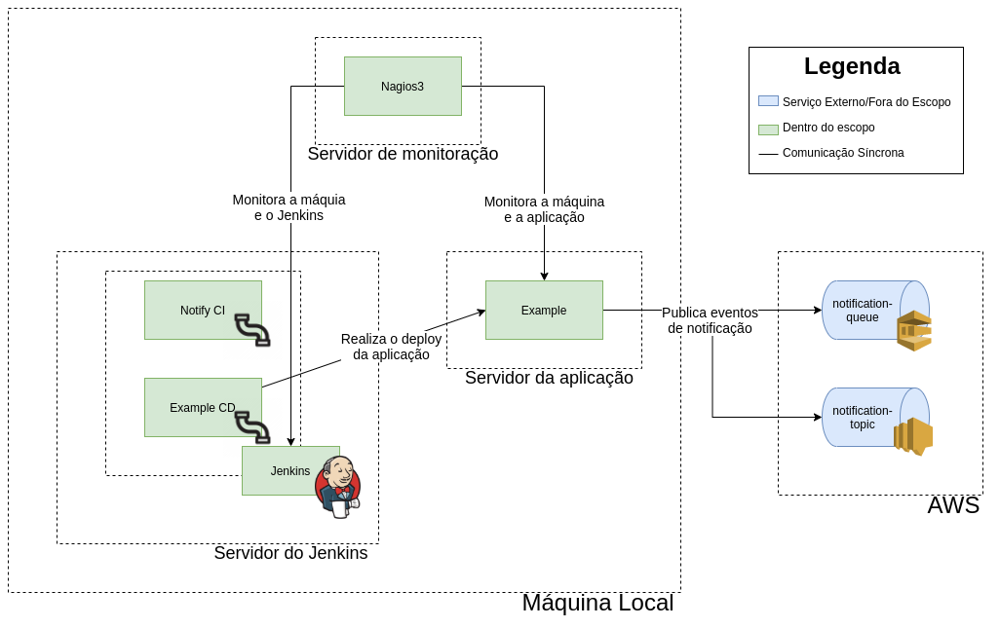

# P2

*TODO:*
- Finalizar ansible do Jenkins, erro atual:
```java
java.io.IOException: Permission denied
	at java.base/java.io.UnixFileSystem.createFileExclusively(Native Method)
	at java.base/java.io.File.createTempFile(File.java:2129)
	at hudson.util.AtomicFileWriter.<init>(AtomicFileWriter.java:142)
Caused: java.io.IOException: Failed to create a temporary file in /data/jenkins
	at hudson.util.AtomicFileWriter.<init>(AtomicFileWriter.java:144)
	at hudson.util.AtomicFileWriter.<init>(AtomicFileWriter.java:109)
	at hudson.util.AtomicFileWriter.<init>(AtomicFileWriter.java:84)
	at hudson.util.AtomicFileWriter.<init>(AtomicFileWriter.java:74)
	at hudson.util.TextFile.write(TextFile.java:116)
	at jenkins.model.Jenkins.<init>(Jenkins.java:908)
	at hudson.model.Hudson.<init>(Hudson.java:85)
	at hudson.model.Hudson.<init>(Hudson.java:81)
	at hudson.WebAppMain$3.run(WebAppMain.java:295)
Caused: hudson.util.HudsonFailedToLoad
	at hudson.WebAppMain$3.run(WebAppMain.java:312)
```
- Criar pipeline de CI para o notify (git clone e teste)
- Criar pipeline de CD para o notify (git clone e nova tag do git)
- Criar pipeline de CD da aplicação de exemplo (clone e deploy no
  servidor da app)
- Relatório (acho que esse podemos fazer na segunda, tem o trabalho de
  projetos empreendedores)



## Vagrant

...

## Ansible

ansible-galaxy collection install community.general
ansible-galaxy install emmetog.jenkins


## Terraform

...


## Aplicação de exemplo

...
